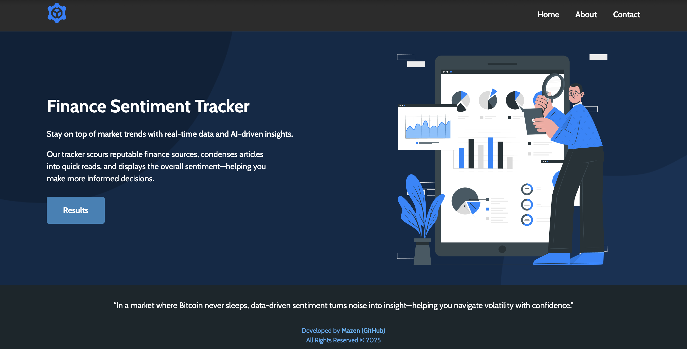
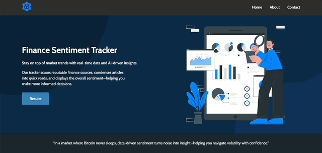

# Finance Sentiment Analyzer (DEMO BELOW)
**AI-driven tool for analyzing Bitcoin-related news and visualizing sentiment trends.**

---

## 1. High-Level Overview

This project addresses the challenge of staying current with rapidly evolving crypto headlines by automatically retrieving and analyzing Bitcoin news. It provides a concise overview of each article and evaluates sentiment over time. By presenting a clear sentiment trend in conjunction with real market data, it enables quicker and more informed decision-making.

---

## 2. Key Features

- **Automated News Scraping**: Gathers the latest Bitcoin-related articles from multiple sources daily.  
- **AI Summarization**: Condenses lengthy articles into digestible overviews.  
- **Daily Sentiment Tracking**: Assigns a sentiment score (ranging from negative to positive) to each article, aggregated daily.  
- **Interactive Dashboard**: Displays daily sentiment data overlaid on Bitcoin price movements, helping identify correlations at a glance.  
- **Today/Yesterday Toggle**: Allows immediate comparison between current and previous day’s news.

---

## 3. Tech Stack

- **Python** and **Flask** – Core server-side application and routing  
- **Selenium** + **BeautifulSoup** – Dynamic scraping and HTML parsing  
- **Hugging Face Transformers** (BART, FinBERT) – Automated text summarization and sentiment analysis  
- **SQLite** – Local data storage and daily sentiment aggregation  
- **Plotly** – Interactive data visualization of price vs. sentiment  
- **Docker** + **Gunicorn** – Containerized deployment for production  

---

## 4. Live Demo

**Screenshot of the Homepage:**

**App Overview in Action (GIF):**

---

## 5. Architecture

1. **News Gathering**: Regularly fetches and updates relevant Bitcoin news links.  
2. **Processing**: Summarizes articles and evaluates sentiment in near-real-time.  
3. **Storage & Aggregation**: Maintains a database of articles and daily statistics for historical reference.  
4. **Visualization**: Presents a web-based dashboard that correlates sentiment trends with market data.

---

## 6. Roadmap / Future Enhancements

- **Multi-Coin Coverage**: Expand automated analysis to include additional cryptocurrencies.    
- **Enhanced Data Sources**: Broaden scope by including further news outlets or specialized crypto feeds.

---

## 7. Contributing

Contributions and suggestions are welcome. To propose changes or new features, please open an issue or submit a pull request. All collaboration is appreciated.

---
